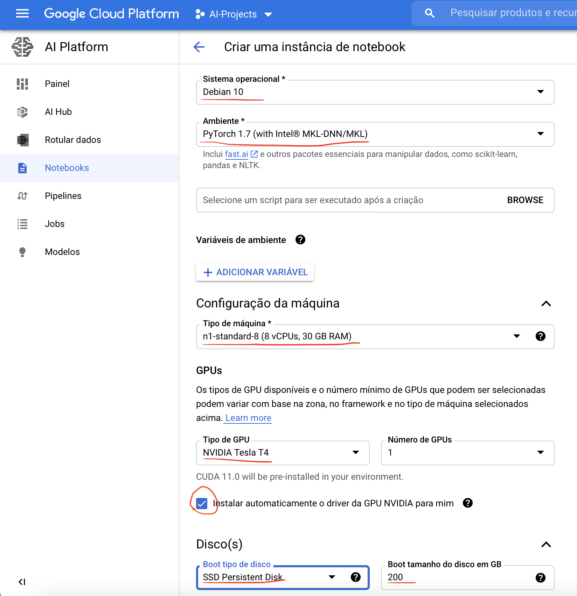
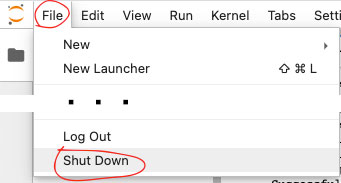
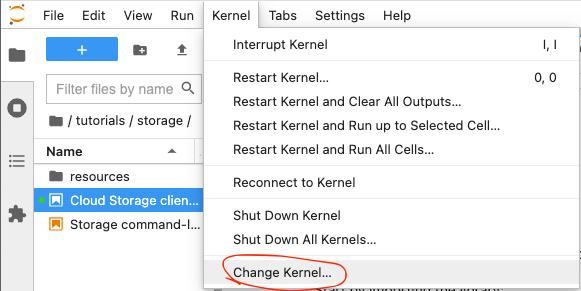
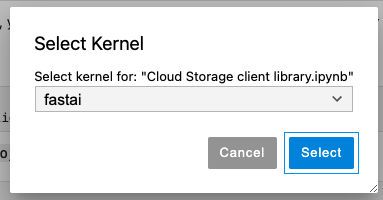

# How to config JupyterLab in GCP with Fastai and Pytorch 1.7.1
[](https://semver.org)

During these days using Google Cloud Platform Ai Platform Notebook creation i have found a lots of issues using the
out-of-box images they have available:
* Python out of date ( version 3.7, until now latest version is python 3.9.1)
* JupyterLab out of date ( version 1.2, until now latest version is python 3.0.7)
* Trying to install latest fastai and retrieving an old version
* Lots of out of date and useless python packages


## Getting Started

I tried to find the Best Way to create a notebook in Ai Platform and install all the packages and dependencies
required to run Fastai Deep Learning projects.

I spent lots of days testing some combinations of VMs, containers and installations,
after i reached final a good solution.

Here I will share the best way that I found ( maybe a better one is possible, feel free to share here if you know it :) )
to create a GCP Notebook instance and have everything updated and running with GPU processing and everything to get started
to Deep Learning.

### Prerequisites

First you need to Create a GCP Notebook Instance as follows:

* Create New Instance
    * Custom Instance


Choose the instance name you want and prefer a region/zone with lowest latency you.
Can use this tool to discover https://gcping.com/
The Important configs to choose is:
* Debian 10
* PyTorch 1.7 (with Intel MKL-DNN/MKL)

The Hardware and machine type can be whatever you prefer, but I recommend the following:
* n1-standard-8 (8 vCPUs, 30 GB RAM)
* NVIDIA Tesla T4
* Mark option to Install GPU NVIDIA Drivers
* Boot disk Type SSD Persistent Disk 200 GB





### Installing


After Creating the Instance and it starts up, click "Open JupyterLab" and open terminal
type the following commands:

Remove old jupyterlab and reinstall the latest one
```
conda uninstall jupyterlab -y
conda install -c conda-forge jupyterlab=3 -y
```
Install the latest python version and dependencies required in a new env and activate it

Create a new conda environment with python 3.9 ( latest when I wrote this document ) named fastai,
but you choose the name you prefer
```
conda create --name fastai python=3.9 -y
conda activate fastai
```
Now install fastai, pytorch and other dependencies required
```
conda install -c fastai -c pytorch fastai -y
conda install -c fastai fastbook -y
git clone https://github.com/fastai/fastbook.git
pip install -Uqq fastbook
```
#### Optional (Google Cloud Storage - Buckets)
If you want to use the GCS tools to read/write on Buckets,  install/update the following packages:
```
pip install --upgrade google-cloud-storage
```
#### Optional 2 (More Packages)
If you want install some additional and useful packages for Data Science for example:
* wandb - Weights & Biases - Dev tools for ML
* gh -  GitHub CLI
```
conda install -c conda-forge wandb gh
```

To finish config  jupyterlab to use the created fastai (or the name you chose) environment as kernel
```
conda install ipykernel -y
ipython kernel install --user --name=fastai
```
Now restart JupyterLab
* Go to **File -> Shut Down**  to shut down the JupyterLab

  
* Close browser tab
* Go to AI Platform Notebooks and click again on "OPEN JUPYTERLAB"
* Change the kernel to the previously created fastai (or the name you chose)




**Now your ready to go and start coding**


## Software Version
* **Python v3.9.1**
* **Pytorch v1.7.1**
* **Fastai v2.2.5**
* **Nvidia Cuda Driver 11**
* **JupyterLab v3.0.7**
## Author Guide
* **Leozítor Floro de Souza** - [Github](https://github.com/leozitor)

## Acknowledgment
* [Fastai Website](https://www.fast.ai)
* [Fastai Forums](https://forums.fast.ai)
* [Fastai GitHub](https://github.com/fastai)
